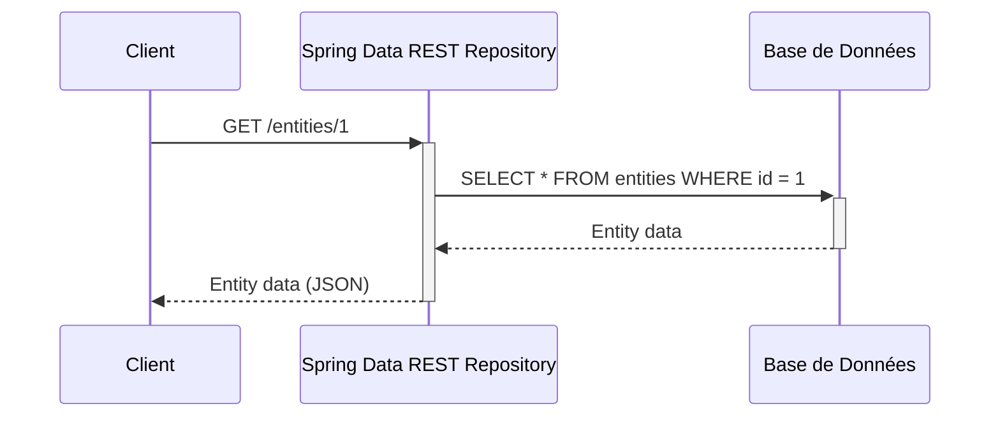
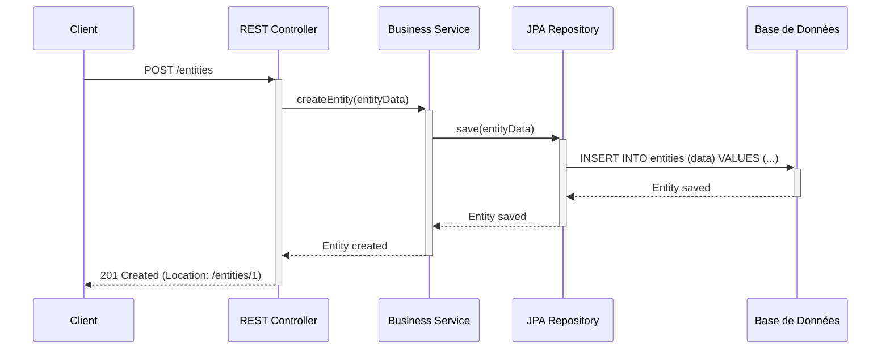
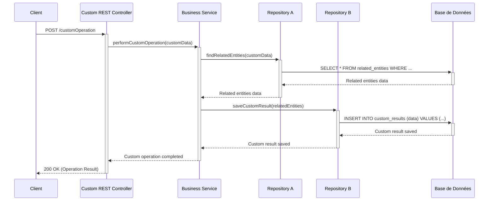

Ceci est un repository de test qui a servi a réaliser l'article suivant : 


- https://medium.com/norsys-octogone/adieu-les-controller-avec-spring-data-rest-821420089cda


# Adieu les Controller avec Spring data REST
**Baptiste Thery**  
*norsys-octogone*

**Publié dans norsys-octogone**  
*6 min read*  
*Jun 16, 2021*

---

Spring data rest est une partie du framework Spring data qui permet d’exposer des Web Services basés sur les repository.

## Introduction
Cela fait maintenant plusieurs années que je code avec Spring, et suite à l’avènement des micro services, certaines API exposent du CRUD sans règle métier. Qui n’a pas croisé un micro-service “en couche” qui fait passe-plat vers le repository:

> Pourquoi écrire un “service” et un “controller” s’ils ne font que passe-plat ?

N’ayant pas de bonne réponse dans mon cas d’usage, le controller et le service deviennent, pour moi, du code inutile. J’ai donc cherché à les supprimer. Pour la partie “service”: aucun souci, il suffit de supprimer la classe. Pour la partie “controller”: c’est plus compliqué, puisqu’il sert à déclarer nos routes, c’est là que Spring Data Rest intervient!

## Mise en place d’un projet de test
On commence par importer les bonnes dépendances avec Maven: Java 11 et Spring Boot 2.4.5. Nous ajoutons une base H2 (in memory) et Lombok pour faciliter le développement de notre test.


```xml

<?xml version="1.0" encoding="UTF-8"?>
<project xmlns="http://maven.apache.org/POM/4.0.0" xmlns:xsi="http://www.w3.org/2001/XMLSchema-instance"
         xsi:schemaLocation="http://maven.apache.org/POM/4.0.0 https://maven.apache.org/xsd/maven-4.0.0.xsd">
    <modelVersion>4.0.0</modelVersion>
    <....>
    <dependencies>
        <dependency>
            <groupId>org.springframework.boot</groupId>
            <artifactId>spring-boot-starter-data-rest</artifactId>
        </dependency>
        <dependency>
            <groupId>org.springframework.boot</groupId>
            <artifactId>spring-boot-starter-data-jpa</artifactId>
        </dependency>
        <dependency>
            <groupId>com.h2database</groupId>
            <artifactId>h2</artifactId>
            <scope>runtime</scope>
        </dependency>
        <dependency>
            <groupId>org.springframework.boot</groupId>
            <artifactId>spring-boot-starter-test</artifactId>
            <scope>test</scope>
        </dependency>
        <dependency>
            <groupId>org.projectlombok</groupId>
            <artifactId>lombok</artifactId>
            <version>1.18.20</version>
            <scope>provided</scope>
        </dependency>
    </dependencies>
    <....>
</project>
```

Ensuite un peu de configuration pour générer la BDD directement depuis les annotations JPA.

```properties
spring.datasource.url=jdbc:h2:mem:test
spring.datasource.username=sa
spring.datasource.password=password

spring.jpa.hibernate.ddl-auto=create
```

## Let’s code !
Ici nous décrivons des maisons avec leurs habitants, leurs adresses et leurs meubles.

Ensuite nous implémentons les repositories correspondants aux entités.

> Note importante: aucun repository n’est mis en place pour les habitants.

## S’équiper correctement
Une bonne façon d’explorer les possibilités offertes par Spring Data Rest est d’utiliser un navigateur HAL. Il suffit d’ajouter la dépendance suivante et d’appeler l’endpoint `http://localhost:8080/browser/index.html`.

## Il ne reste plus qu’à tester
Démarrons notre serveur avec le jeu de données suivant.

### Rechercher de la donnée
Nous retrouvons bien notre liste de maisons avec leurs adresses, les fournitures et les habitants associés. À noter: pour les habitants, comme le repository n’a pas été créé, aucun service n’expose la donnée. Celle-ci se retrouve donc directement dans le JSON de la maison. Pour les autres, l’API fournit un lien vers la donnée dans le plus strict respect des normes HATEOAS.

### Insérer de la donnée
Pour les opérations d’insertion, afin de lier la ressource courante à une autre ressource, si un repository existe, on fournira un “path” vers la ressource cible. Sinon, il faut fournir un JSON correspondant à la structure de l’objet. Nous insérons d’abord une “furniture”.

Ensuite nous pouvons insérer une “house” avec la “furniture” créée précédemment.

Alors `GET houses/5/furnitures` est bien un lien vers les meubles de la maison, on y retrouvera le “sofa” créé précédemment.

## Autres opérations possibles
- **PATCH exemple**: `PATCH /houses/4` permet de modifier de la donnée existante. La donnée peut être définie partiellement.
- **DELETE exemple**: `DELETE /houses/4` permet de supprimer la ressource existante.
- **PUT exemple**: `PUT /houses/4` permet de créer ou de modifier de la data existante qui à la différence du PATCH doit être définie dans sa totalité.

### Quelques méthodes “maison”
Nous allons ajouter à l’un de nos repository une méthode personnalisée construite avec JPA.

Cette méthode est automatiquement exposée sous le “search” de la ressource fournie par le repository. Là où toutes les méthodes sont listées.

Ainsi, on pourra interroger le serveur de cette façon et récupérer la ressource House.

### Tri/pagination
Pour appliquer le tri et la pagination sur une entité, il suffit de modifier la classe étendue par le repository avec `PagingAndSortingRepository<T, ID>`.

Si par exemple, on fait la modification pour la classe `FurnituresRepository`:

Le service est alors défini de la façon suivante, et l’on voit apparaître 3 nouveaux paramètres :

- pagination
- tri

Et si l’on souhaite appliquer le tri sur plus d’une propriété, on utilise plusieurs fois le paramètre `sort`, alors le tri sera appliqué dans l'ordre d'apparition des paramètres dans l'URL.

### Validation
Nous souhaitons maintenant créer un validateur empêchant la sauvegarde d’une maison ayant le nom “test”. D’après la documentation, il faut implémenter un “validator” et générer un bean dans notre contexte d’application avec un nom ayant le formalisme suivant: `[eventName][entityName]Validator`. Ainsi le code suivant devrait fonctionner:

Lors de l’appel à la méthode `supports`, si le retour est `true`, c’est à dire que la classe à valider est `House`, alors la méthode `validate` est exécutée sinon le validator n’est pas pris en compte.

> Note importante: le `@Component("beforeCreateHouseValidator")` doit permettre d’assigner le validator au bon “event”. Cependant, un bug est en cours de traitement sur le projet et empêche ce fonctionnement. Nous allons donc supprimer l’annotation. Plusieurs “workarounds” sont disponibles sur le ticket, nous nous intéressons ici à l’approche “manuelle”.

Il faut ajouter une configuration pour indiquer à Spring lors de quel “event” le validator est exécuté.

Ici notre validator est exécuté avant chaque `create` (HTTP POST).

## Modifier le format de la ressource
Pour ce faire il suffit d’utiliser les “projections”. Une projection est une “vue” particulière de la ressource qui peut être utilisée par le client.

Par exemple, si nous souhaitons avoir une visualisation de `House` avec uniquement le `name` et la liste des `furnitures`. Il faut créer la projection.

> Attention, pour être scanné automatiquement par Spring, les projections doivent être dans le même package que l’entity cible. Sinon il est possible d’enregistrer une projection manuellement.

Ensuite cette “vue” peut être exploitée de cette manière:

> Note importante: dans le cas d’une projection, tous les champs sont directement fournis “inline”. C’est pourquoi les informations de `furnitures` sont fournies directement dans le tableau et non pas au travers d’une référence, même si le repository est exposé.

### Afficher la data d’un fils dont le repository existe
Il est possible de déterminer une projection “par défaut” utilisée uniquement depuis une ressource parente. Par exemple, on peut ajouter l’annotation:
`@RepositoryRestResource(excerptProjection=FurnitureExcerpt.class)` au `FurnituresRepository`. Ainsi, lorsque l’on charge une maison, la donnée de `furniture` est fournie directement. `House` prend alors la forme suivante:

> Note importante: la ressource `GET /furnitures` reste inchangée, il s’agit là d’avoir une “preview” de l’objet depuis les parents.

### Gérer la concurrence
Nous souhaitons maintenant gérer les modifications concurrentes d’une ressource. Cela permet, entre autre, d’empêcher le scénario suivant:
- un utilisateur A accède à une ressource qu’il souhaite modifier,
- un utilisateur B accède à la même ressource,
- l’utilisateur A pousse une modification,
- l’utilisateur B pousse une autre modification.

Alors B écrase les modifications apportées par A sans s’en rendre compte. Pour éviter cet effet, Spring Data Rest propose d’utiliser la “version” d’une ressource au travers d’un header appelé `ETAG`.

Il faut ajouter une version à notre entity:

Suite à cet ajout, un `ETAG` sera fourni dans le header pour chaque `GET`.
Par exemple, `GET /houses/1` fournira `ETAG:1`.
Lors du `PUT` permettant de modifier la maison, on ajoutera le header `If-Match:1`.
Par exemple, `PUT /houses/1` avec header `If-Match:1`.
Suite au `PUT`, le `ETAG` devient 2. Si l’on réitère l’opération en gardant le
`If-Match:1` alors on reçoit une réponse `412 precondition failed`.

De la même façon, on peut utiliser une date lors des `GET` afin de recevoir la donnée uniquement si celle-ci a été modifiée. On ajoute `@LastModifiedDate Date date` dans l’entity, un nouvel header apparaît dans les réponses suite à un `GET`, le `Last-Modified`, que l’on peut utiliser lors d’un `GET` postérieur avec le header `If-Modified-Since:MA-DATE`. Ainsi, si la date fournie est antérieure à `Last-Modified` alors une réponse `200` est retournée avec la ressource, sinon une réponse `304 not modified` est retournée. Cela permet d’optimiser les performances en limitant l’usage du réseau.

## Limitations, où quand et comment remettre des controllers
Dans certains cas, il arrive que les opérations fournies ne correspondent pas aux process fonctionnels, il peut être nécessaire de créer manuellement des “controllers”.

Pour ce faire, il existe plusieurs annotations :

- `@BasePathAwareController` et `@RepositoryRestController` sont utilisées pour créer manuellement des endpoints, en profitant des configurations Spring Data REST du projet.
- `@RestController` (annotations standard REST) crée, par contre, un ensemble parallèle de endpoints avec des options de configuration différentes (mappeurs différents, gestionnaires d’erreurs différents, etc.).

Un petit exemple avec l’annotation `@RepositoryRestController`:

## Conclusion
Spring Data Rest permet d’exposer et manipuler des web services en implémentant uniquement les “repository”. L’outil a de nombreux avantages mais aussi quelques inconvénients, il faut donc l’utiliser dans le bon cas.

### Les plus:
- Allège le code, le rend facile à maintenir
- Fournit un Webservice “standard” qui suit les normes HATEOAS
- Permet de manipuler/modifier simplement le Webservice
- Mise en œuvre simple de la gestion de la concurrence
- Permet facilement l’ajout de règles personnalisées
- Prise en main rapide

### Les moins:
- HATEOAS peut amener de la latence s’il est mal exploité
- HATEOAS peut être complexe à utiliser pour les non initiés
- Le projet est moins connu que Spring Web
- Peu d’intérêt si votre API a de nombreuses règles métiers

Les sources du test sont disponibles ici.

Dans un projet qui utilise Spring Data REST, les rôles des "services" et des "controllers" peuvent être redéfinis ou réduits en fonction des besoins spécifiques du projet. Voici un aperçu des rôles potentiels de ces composants :

### Rôle du "Service" :

1. **Règles Métier Complexes** :
   - Si votre application nécessite des règles métier complexes qui ne peuvent pas être gérées simplement par les méthodes CRUD des repositories, vous devrez probablement créer des services. Les services encapsulent la logique métier et permettent de la réutiliser dans différents contextes.

2. **Orchestration de Transactions** :
   - Les services peuvent être utilisés pour orchestrer des transactions qui impliquent plusieurs repositories ou d'autres systèmes externes, garantissant que toutes les opérations sont effectuées de manière atomique.

3. **Validation Avancée** :
   - Bien que certaines validations puissent être effectuées directement dans les entités ou via des validateurs spécifiques, des validations complexes nécessitant des règles métier avancées peuvent être mieux gérées dans les services.

4. **Interfaçage avec d'autres Systèmes** :
   - Si votre application doit interagir avec des systèmes externes (comme des services web tiers, des queues de messages, etc.), le code d'intégration est souvent mieux placé dans les services.

### Rôle du "Controller" :

1. **Endpoints Personnalisés** :
   - Même si Spring Data REST expose automatiquement les méthodes CRUD des repositories, vous pouvez avoir besoin de créer des endpoints personnalisés pour des opérations spécifiques qui ne sont pas couvertes par ces méthodes standard.

2. **Manipulation de la Requête et de la Réponse** :
   - Si vous avez besoin de manipuler les requêtes entrantes ou les réponses sortantes (par exemple, ajouter des en-têtes spécifiques, transformer les données avant de les envoyer, etc.), les contrôleurs vous donnent la flexibilité nécessaire.

3. **Authentification et Autorisation** :
   - Bien que Spring Security puisse être configuré pour sécuriser les endpoints exposés par Spring Data REST, il peut y avoir des scénarios où vous avez besoin d'un contrôle plus granulaire sur l'accès à certaines routes, ce qui peut être plus facile à gérer dans des contrôleurs dédiés.

4. **Agrégation de Données** :
   - Les contrôleurs peuvent être utilisés pour créer des endpoints qui agrègent des données de plusieurs sources ou effectuent des opérations complexes avant de renvoyer les résultats au client.

### Quand Utiliser des "Services" et des "Controllers" avec Spring Data REST :

- **Utiliser des Services** :
  - Lorsque vous avez des règles métier complexes.
  - Lorsque vous avez besoin d'orchestrer des transactions impliquant plusieurs entités.
  - Pour des validations avancées ou spécifiques.
  - Pour intégrer des systèmes externes.

- **Utiliser des Controllers** :
  - Pour des endpoints personnalisés qui ne suivent pas le schéma CRUD standard.
  - Pour manipuler les requêtes et les réponses.
  - Pour implémenter des logiques d'authentification et d'autorisation avancées.
  - Pour des agrégations de données ou des transformations complexes avant de répondre aux clients.

En résumé, bien que Spring Data REST simplifie l'exposition des opérations CRUD via les repositories, les services et les contrôleurs restent des composants essentiels pour gérer des cas d'utilisation plus complexes ou spécifiques.

Pour illustrer les rôles des "services" et des "controllers" dans un projet utilisant Spring Data REST, nous pouvons utiliser des diagrammes de séquence. Voici deux exemples de diagrammes de séquence complets :

### 1. Diagramme de Séquence pour une Opération CRUD Simple

#### Scénario : Récupération d'une Entité

```plaintext
Client -> Spring Data REST Repository -> Base de Données
```




### 2. Diagramme de Séquence pour une Opération Complexe avec Service et Controller

#### Scénario : Création d'une Entité avec Logique Métier

```plaintext
Client -> Controller -> Service -> Repository -> Base de Données
```




### Explication des Diagrammes :

#### Diagramme 1 : Récupération d'une Entité
- **Client** : Le client (comme une application front-end ou un outil de test API) envoie une requête GET pour récupérer une entité.
- **Spring Data REST Repository** : Spring Data REST intercepte la requête et utilise le repository pour interroger la base de données.
- **Base de Données** : Le repository exécute une requête SQL pour récupérer les données de l'entité.
- **Réponse** : Les données de l'entité sont renvoyées au client sous forme de JSON.

#### Diagramme 2 : Création d'une Entité avec Logique Métier
- **Client** : Le client envoie une requête POST pour créer une nouvelle entité.
- **Controller** : Le contrôleur REST intercepte la requête et la transmet au service.
- **Service** : Le service applique la logique métier nécessaire avant de sauvegarder l'entité.
- **Repository** : Le service utilise le repository pour persister l'entité dans la base de données.
- **Base de Données** : Le repository exécute une requête SQL pour insérer les données de l'entité.
- **Réponse** : Une réponse HTTP 201 Created est renvoyée au client avec l'emplacement de la nouvelle entité.

Ces diagrammes de séquence montrent comment les composants interagissent dans des scénarios simples et complexes, mettant en évidence le rôle des services et des contrôleurs dans un projet utilisant Spring Data REST.

### 3. Diagramme de Séquence pour une Validation Avancée avant la Création d'une Entité

#### Scénario : Création d'une Entité avec Validation

```plaintext
Client -> Controller -> Service -> Validation -> Repository -> Base de Données
```

```mermaid
   sequenceDiagram
    participant Client
    participant Controller as REST Controller
    participant Service as Business Service
    participant Validator as Custom Validator
    participant Repository as JPA Repository
    participant Database as Base de Données

    Client->>+Controller: POST /entities
    Controller->>+Service: createEntity(entityData)
    Service->>+Validator: validate(entityData)
    alt Validation Success
        Validator-->>-Service: Validation Passed
        Service->>+Repository: save(entityData)
        Repository->>+Database: INSERT INTO entities (data) VALUES (...)
        Database-->>-Repository: Entity saved
        Repository-->>-Service: Entity saved
        Service-->>-Controller: Entity created
        Controller-->>-Client: 201 Created (Location: /entities/1)
    else Validation Failure
        Validator-->>-Service: Validation Failed
        Service-->>-Controller: Validation Error
        Controller-->>-Client: 400 Bad Request (Validation Error)
    end

```

### 4. Diagramme de Séquence pour une Opération Personnalisée via un Controller

#### Scénario : Opération Complexe nécessitant un EndPoint Personnalisé

```plaintext
Client -> Custom Controller -> Service -> Multiple Repositories -> Base de Données
```





### Explication des Diagrammes :

#### Diagramme 3 : Création d'une Entité avec Validation
- **Client** : Le client envoie une requête POST pour créer une nouvelle entité.
- **Controller** : Le contrôleur REST intercepte la requête et la transmet au service.
- **Service** : Le service demande la validation de l'entité par un validateur customisé.
- **Validator** : Le validateur vérifie les règles spécifiques sur les données de l'entité.
  - **Validation Success** : Si la validation passe, le service continue avec la sauvegarde de l'entité.
  - **Validation Failure** : Si la validation échoue, le service retourne une erreur de validation au contrôleur.
- **Repository** : Le service utilise le repository pour persister l'entité validée dans la base de données.
- **Réponse** : Une réponse HTTP 201 Created est renvoyée au client si la validation réussit, sinon une réponse HTTP 400 Bad Request est renvoyée en cas d'erreur de validation.

#### Diagramme 4 : Opération Complexe nécessitant un EndPoint Personnalisé
- **Client** : Le client envoie une requête POST pour effectuer une opération personnalisée.
- **CustomController** : Le contrôleur personnalisé intercepte la requête et la transmet au service pour traitement.
- **Service** : Le service exécute une opération complexe qui nécessite l'interaction avec plusieurs repositories.
  - **Repository A** : Le service interroge le repository A pour récupérer des entités liées.
  - **Repository B** : Après avoir récupéré les entités liées, le service utilise le repository B pour sauvegarder le résultat de l'opération personnalisée.
- **Base de Données** : Les repositories exécutent les requêtes SQL nécessaires pour récupérer et persister les données.
- **Réponse** : Une réponse HTTP 200 OK est renvoyée au client avec le résultat de l'opération.

Ces diagrammes illustrent les interactions complexes entre les composants dans un projet Spring Data REST, en mettant en avant le rôle crucial des services et des contrôleurs dans les scénarios nécessitant une logique métier avancée, des validations personnalisées et des opérations spécifiques.
